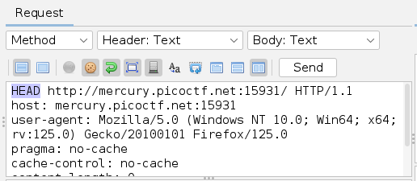

# GET aHEAD

## Intuition

- Emphasize the importance of the `GET` and `HEAD` endpoints.
- This method can be integrated with [OWASP ZAP][zap].

## Approach

1. **Initiate an Attack in ZAP**:
   - Open ZAP and start a new attack.

   

2. **Focus on the Endpoints**:
   - Identify and focus on the `GET` and `HEAD` endpoints in your target application.

   

3. **Observe the Endpoints**:
   - Notice that the `HEAD` endpoint might not be initially present or visible, despite being emphasized.

4. **Create a HEAD Request**:
   - Manually create a request using the `HEAD` method. Use the existing `GET` endpoint as a reference to construct this request.

   

5. **Retrieve the Flag**:
   - Send the `HEAD` request and examine the response to obtain the flag or desired information.

   

[zap]: https://www.zaproxy.org/
